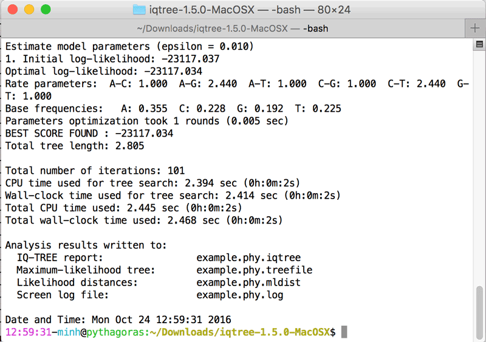

Getting started
===============

Recommended for users who just downloaded IQ-TREE the first time.
<!--more-->

IQ-TREE web server
------------------

The quickest is to try out the [IQ-TREE web server](http://iqtree.cibiv.univie.ac.at), where you only need to upload an alignment, choose the options and start the analysis. There is a [web server tutorial here](Web-Server-Tutorial). 

If you want to use the command-line version, follow the instructions below.

Installation
------------

For reasons of performance, IQ-TREE is a command-line program, i.e., IQ-TREE needs to be run from a terminal/console (command prompt under Windows).

### Packages and bundles

Ready made IQ-TREE packages are available for the following distributions/repositories (command to install iqtree):

* [Debian Linux](https://packages.debian.org/unstable/science/iqtree): `sudo apt-get install iqtree`
* [Arch Linux (AUR)](https://aur.archlinux.org/packages/iqtree-latest/)
* [Anaconda](https://anaconda.org/bioconda/iqtree): `conda install -c bioconda iqtree`
* [Homebrew](http://braumeister.org/repos/Homebrew/homebrew-science/formula/iqtree): `brew install homebrew/science/iqtree`
* [FreeBSD](https://www.freshports.org/biology/iqtree/): `pkg install iqtree`

### Manual download

IQ-TREE for Windows, MacOSX and Linux can be [downloaded here](http://www.iqtree.org/#download).

* Extract the `.zip` (Windows, MacOSX) or `.tar.gz` (Linux) file to create a directory `iqtree-X.Y.Z-OS` or `iqtree-omp-X.Y.Z-OS`, where `X.Y.Z` is the version number and `OS` is the operating system (Windows, MacOSX or Linux).
* You will find the executable in the `bin` sub-folder. Copy all files in `bin` folder to your system search path such that you can run IQ-TREE by entering `iqtree` or `iqtree-omp` from the Terminal.

Now you need to open a Terminal (or Console) to run IQ-TREE. See below the guide for [Windows users](#for-windows-users) and [Mac OS X users](#for-mac-os-x-users).

For Windows users
-----------------

Since IQ-TREE is a command-line program, clicking on `iqtree.exe` will not work. You have to open a Command Prompt for all analyses:

1. Click on "Start" menu (below left corner of Windows screen).
2. Type in "cmd" and press "Enter". It will open the Command Prompt window (see Figure below).
3. Go into IQ-TREE folder you just extracted by entering e.g. (assuming you downloaded version 1.5.0):

        cd Downloads\iqtree-1.5.0-Windows
        
    (assuming that IQ-TREE was downloaded into `Downloads` folder).
4. Now you can try an example run by entering:

        bin\iqtree -s example.phy
        
    (`example.phy` is the example PHYLIP alignment file also extracted in that folder).
5. After a few seconds, IQ-TREE finishes and you may see something like this:

Congratulations ;-) You have finished the first IQ-TREE analysis.

For Mac OS X users
------------------

1. Open the "Terminal", e.g., by clicking on the Spotlight icon (top-right corner), typing "terminal" and press "Enter".
2. Go into IQ-TREE folder by entering (assuming you downloaded version 1.5.0):

        cd Downloads/iqtree-1.5.0-MacOSX

    (assuming that IQ-TREE was downloaded into `Downloads` folder).
3. Now you can try an example run by entering 

        bin/iqtree -s example.phy

    (`example.phy` is the example PHYLIP alignment file also extracted in that folder).
4. After a few seconds, IQ-TREE finishes and you may see something like this:

Congratulations ;-) You have finished the first IQ-TREE analysis.

Minimal command-line examples
-----------------------------

A few typically analyses are listed in the following. Note that it is assumed that `iqtree` executable was already copied into system search path. If not, please replace `iqtree` with actual path to executable.

* Infer maximum-likelihood tree from a sequence alignment (`example.phy`)
   with the best-fit model automatically selected by ModelFinder:

        # for version >= 1.5.4
        iqtree -s example.phy

        # for version <= 1.5.3
        iqtree -s example.phy -m TESTNEW

        (use '-m TEST' to resemble jModelTest/ProtTest)

* Infer maximum-likelihood tree using `GTR+I+G` model:

        iqtree -s example.phy -m GTR+I+G

* Perform ModelFinder without subsequent tree inference:
        
        # for version >= 1.5.4
        iqtree -s example.phy -m MF

        # for version <= 1.5.3
        iqtree -s example.phy -m TESTNEWONLY

        (use '-m TESTONLY' to resemble jModelTest/ProtTest)

* Combine ModelFinder, tree search, SH-aLRT test and ultrafast bootstrap with 1000 replicates:

        # for version >= 1.5.4
        iqtree -s example.phy -alrt 1000 -bb 1000

        # for version <= 1.5.3
        iqtree -s example.phy -m TESTNEW -alrt 1000 -bb 1000

* Perform edge-linked proportional partition model (`example.nex`):

        iqtree -s example.phy -spp example.nex

        (replace '-spp' by '-sp' for edge-unlinked model)

* Find best partition scheme by possibly merging partitions:

        # for version >= 1.5.4
        iqtree -s example.phy -sp example.nex -m MF+MERGE

        # for version <= 1.5.3
        iqtree -s example.phy -sp example.nex -m TESTNEWMERGEONLY
        
        (use '-m TESTMERGEONLY' to resemble PartitionFinder)

* Find best partition scheme followed by tree inference and ultrafast bootstrap:

        # for version >= 1.5.4
        iqtree -s example.phy -spp example.nex -m MFP+MERGE -bb 1000

        # for version <= 1.5.3
        iqtree -s example.phy -spp example.nex -m TESTNEWMERGE -bb 1000

        (use '-m TESTMERGE' to resemble PartitionFinder)

* Use 4 CPU cores to speed up computation:

        iqtree-omp -s example.phy -nt 4

* Determine the best number of cores to use under `GTR+R4` model:

        iqtree-omp -s example.phy -m GTR+R4 -nt AUTO

* Show all available options: 

        iqtree -h
        
> **WARNING**: All these commands with `-m ...MERGE...` will always perform an edge-unlinked partition scheme finding even if `-spp` option is used. Only in the next phase of tree reconstruction, then an edge-linked partition model is used. We plan to implement the edge-linked partition finding in version 1.6.

Where to go from here?
----------------------------

Please continue with the **[Beginner's tutorial](Tutorial)** for further usages.

